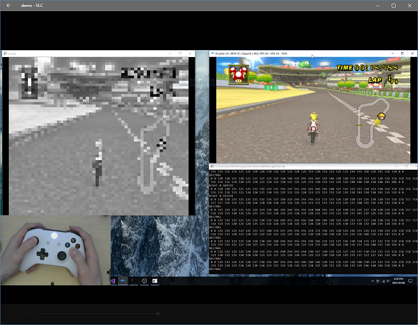

# peachai

Using a convolutional neural network to train Peach to win all the cups! 

Dependencies:
* OpenCV (tested on 3.4.1)
* Dolphin (tested on 5.0)
* only tested on Windows 10
* controller that uses xinput

To run:
1. `mkdir build && cd build`
2. `cmake ..`
3. in vs command prompt: `msbuild [name_of_sln].sln`

Everything has been clang-formatted to Google's style specs as well as using file naming conventions from GOogle's style specs

## Screenshots
